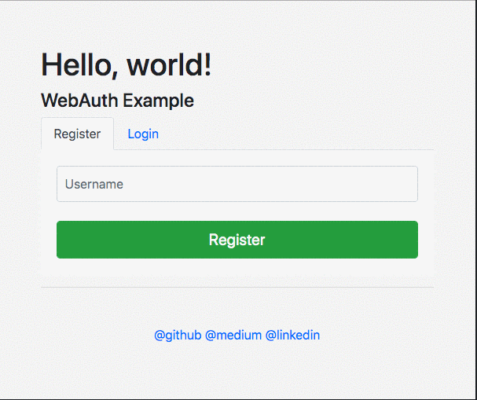

# Webauthn Simple Demo - GoLang

Example of WebAuthn for a presentation. For **Golang**.



## What is WebAuthn?

* The Web Authentication API gives Web applications user-agent-mediated access to authenticators – which are often hardware tokens accessed over USB/BLE/NFC or modules built directly into the platform – for the purposes of generating and challenging application-scoped (eTLD+k) public-key credentials. This enables a variety of use-cases, such as:
* *  Low friction and phishing-resistant 2FA (to be used in conjunction with a password)
* * Passwordless, biometrics-based re-authorization
* * Low friction and phishing-resistant 2FA without a password (to be used for passwordless accounts)

## Browser Status (2019 March)

* Web Authentication is only partially included in 
* Chrome 67, 
* Firefox 60
* Edge build 17723 or newer versions.
* Safari not support.

## Enabling WebAuthn in Chrome

Chrome has flags that my need to be enabled. Paste this into the omnibar:

chrome://flags/#enable-web-authentication-api

MacOS Touch ID:
chrome://flags/#enable-web-authentication-touch-id

## How Register works

* required params
* * userid (server side)
* * challenge (The challenge is produced by the server; see the Security Considerations)
* challenge is generate on server
* As a cryptographic protocol, Web Authentication is dependent upon randomized challenges to avoid replay attacks. Therefore, the values of both PublicKeyCredentialCreationOptions.challenge and PublicKeyCredentialRequestOptions.challenge MUST be randomly generated by Relying Parties in an environment they trust (e.g., on the server-side), and the returned challenge value in the client’s response MUST match what was generated.
* In order to prevent replay attacks, the challenges MUST contain enough entropy to make guessing them infeasible. Challenges SHOULD therefore be at least 16 bytes long.
* After a successful registration, the server stores the "credentialId" it receives from the browser
* credentialId has a timeout period
* The browser is stored inside, it can not be seen


## How login works

* challenge is generate on server
* id (credentialId)

**Example Code**
```javascript
navigator.credentials
  .get({
    publicKey: {
      challenge: base64url.decode("<%= challenge %>"),
      allowCredentials: [
        {
          id: base64url.decode("<%= id %>"),
          type: "public-key"
        }
      ],
      timeout: 15000,
      authenticatorSelection: { userVerification: "preferred" }
    }
  })
  .then(res => {
      .....
```

## All step Simulations
**[webauthn.me](https://webauthn.me/)**
1. Register Your User
2. Touch Your Authenticator
3. Your New Credential
4. Authenticate With Your Credential
5. Touch Your Authenticator
6. Login Successful

## Spec Variables

https://w3c.github.io/webauthn/#idl-index

### Other Demos

* Duo Labs  [golang code](https://github.com/duo-labs/webauthn)
* Google https://webauthndemo.appspot.com/ ([java code](https://github.com/google/webauthndemo))
* WebAuthn org https://webauthn.org
* Yubico https://demo.yubico.com/webauthn/
